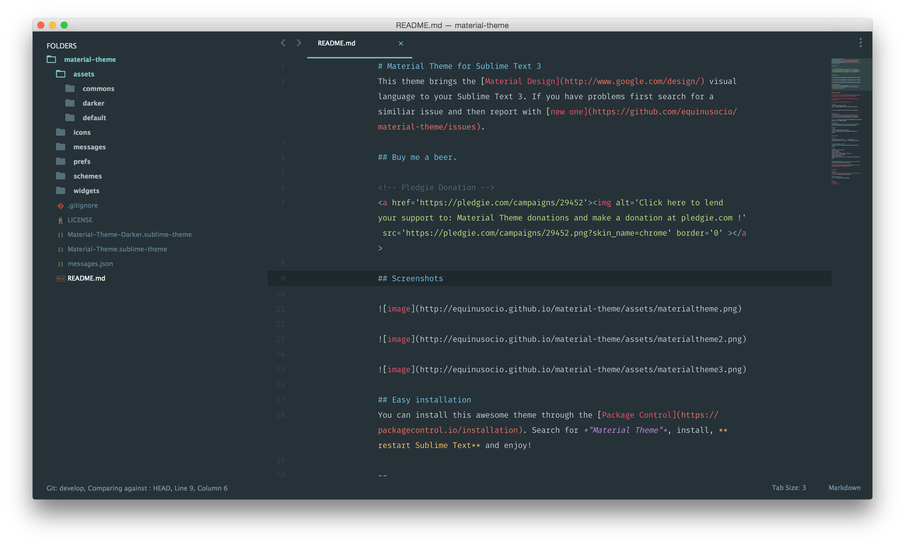

title: Sublime Text
---

## `subl` Shell命令设置

为了方便在终端直接用`SublimeText`打开我们的项目，为此可以设置一下`Subl`来软链接到实际的路径。
   
	#bash shell
	ln -s "/Applications/Sublime\ Text.app/Contents/SharedSupport/bin/subl" /usr/bin/subl

	#zsh shell
	alias subl="'/Applications/Sublime Text.app/Contents/SharedSupport/bin/subl'"
	alias nano="subl"
	export EDITOR="subl"

设置完之后需要执行下面代码将我们的设置生效:

	#bash shell
	source ~/.bashrc
	
	#zsh shell
	source ~/.zshrc

这时候就可以在我们的项目里面执行下面代码直接用`SublimeText`打开项目：
	
	subl .
	# more help
	subl help
	
	
## 编辑器配置


下面是我个人的一些配置，根据个人喜好可以进行修改：

	# 修改配置路径： Sublime Text -> Preferences -> Settings-User
	
	"always_show_minimap_viewport": true, #是否总是显示小地图
	"draw_minimap_border": true, # 让minimap里的当前位置更显眼点.
	"highlight_line": true, # 高亮当前行
	"highlight_modified_tabs": true, # 修改了而尚未保存的 tab, 会用橘黄色显示
	"ignored_packages":
	[
	   "Vintage"
	],
	"show_encoding": true, # 显示文件编码
	"show_full_path": true, # 标题栏上显示完整路径
	"show_line_endings": true, # 文档到达底部会在最后一行
	"open_files_in_new_window": false, #  在 Finder 里打开文件时, 不会新开窗口了
	"translate_tabs_to_spaces": true #将tab键的形式转成空格
	
## Package Control

SublimeText所有插件都依赖于`Package Control`，默认情况下`Package Control`没有自带的，需要手动安装，打开`SublimeText`之后在菜单栏的`View` -> `show Console`，将下面代码贴入控制台并回车。

- SublimeText 3 版本

	```
	import urllib.request,os; pf = 'Package Control.sublime-package'; ipp = sublime.installed_packages_path();urllib.request.install_opener(urllib.request.build_opener( urllib.request.ProxyHandler()) );open(os.path.join(ipp, pf), 'wb').write(urllib.request.urlopen('http://sublime.wbond.net/' + pf.replace(' ','%20')).read())
	```
	
- SublimeText 2 版本

  ```
  import urllib2,os; pf='Package Control.sublime-package'; ipp = sublime.installed_packages_path(); os.makedirs( ipp ) if not os.path.exists(ipp) else None; urllib2.install_opener( urllib2.build_opener( urllib2.ProxyHandler())); open( os.path.join( ipp, pf), 'wb' ).write( urllib2.urlopen('http://sublime.wbond.net/' +pf.replace( ' ','%20')).read()); print( 'Please restart Sublime Text to finish installation')
  ```

上面装完之后就可以`command + shift + p`，搜索需要安装的插件了。

## 推荐主题

强烈推荐[Material Theme](https://github.com/equinusocio/material-theme)。

预览效果：



## 推荐插件

`SublimeText`的最大一个组成部分就是插件，个人觉得插件能够达到`精简实用`最好，下面推荐一些常用的插件，仅供参考。

	# 下面插件的安装方法
	shift + cmd + p 打开命令面板
	输入 “Package Control: Install  Package” 命令
	输入 插件的名称 , 找到后回车安装
	安装成功后在preferences中选择主题

- iTg 主题 （个人比较喜欢的一个主题，还有著名的Soda主题也可以试试）  
- Emmet （前端工程师利器，各种代码补全自动生成，更多介绍移步 [官方文档](http://docs.emmet.io/)）
- converttoUTF8（文档转码工具）
- git（git的一些操作都可以在这里进行）
- sidebarenhancement（侧边栏增强，在侧边右键之后多了一些功能，挺实用的）
- docblockr（文档注释，输入`/*`之后按一下tab就可以生成文档注释）
- Bracket Highlighter（匹配括号高亮，自带的感觉高亮不强）
- SCSS（sass高亮）
- markdownPerview（写markdown可以`command+b`直接生成html预览）
- evernote（配合markdownPerview就可以写markdown同步到evernote去了）

